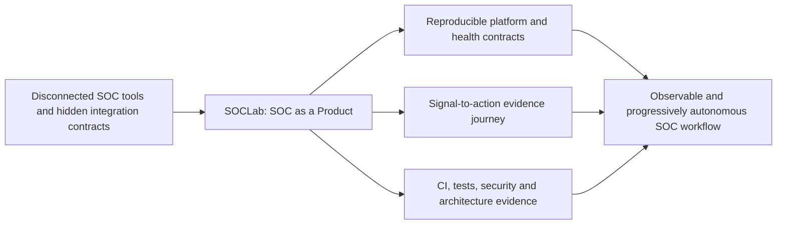
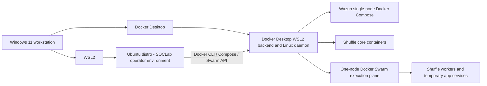

# SOC Lab: Wazuh 5.0.0-beta5 + Shuffle

GitLab-ready automation project for a reproducible SOC/SOAR lab running on a **Windows 11 workstation with WSL2 Ubuntu and Docker Desktop using WSL2 integration**.

## Product story

SOCLab treats the lab as a product rather than a stack of tools: the goal is an understandable, reproducible, observable security workflow that can evolve toward governed AI assistance without claiming capabilities before evidence exists.



See [SOCLab Product Story](docs/product-story.md) for the user journey, current evidence boundary, and product evolution roadmap.

## Runtime platform

The lab is intentionally built as a practical workstation-hosted environment rather than an abstract cloud reference architecture. **Windows 11 is the physical host, Ubuntu runs under WSL2, and Docker Desktop provides the Linux container runtime through its WSL2 backend/integration.** Wazuh runs as a single-node Docker Compose stack, while Shuffle uses the same Docker Desktop daemon and a one-node Docker Swarm execution plane.



See [Architecture](docs/architecture.md) for the detailed runtime, network, datastore, and ownership boundaries.

## Quick start

```bash
chmod +x install.sh
sudo ./install.sh install
./install.sh verify
```

## Commands

```text
install.sh install
install.sh verify
install.sh healthcheck
install.sh status
install.sh logs [wazuh|shuffle|all]
install.sh reset
install.sh credentials
```

`verify` is the local full integration verification command. It runs the same end-to-end health checks as `healthcheck` against the Wazuh + Shuffle lab on your WSL machine.

Documentation is under `docs/` and is built by GitLab CI with MkDocs. See `docs/gitlab.md` for repository setup and authentication guidance.

## CI model

Normal CI runs only on GitLab-hosted runners:

- secret safety scan
- Bash syntax and ShellCheck
- Bats unit/regression tests
- architecture-impact validation and Mermaid diagram rendering
- MkDocs documentation validation
- GitLab Pages build from `main`

No self-hosted GitLab Runner is required. The resource-heavy real Wazuh + Shuffle validation is intentionally run locally on the lab machine with:

```bash
./install.sh verify
```

## Secret handling

No passwords, tokens, private keys, generated TLS material, `.env` files, or runtime credentials belong in Git. The CI pipeline runs `scripts/check-secrets.sh` before lint/test jobs. Runtime-generated credentials are written only under `/opt/soclab` and are excluded by `.gitignore`.

## Runtime credentials

No working passwords, API keys, encryption secrets, private keys, `.env` files, or generated credential inventories belong in Git. `install.sh install` writes the resulting inventory only to `/opt/soclab/state/credentials.txt` with mode `600`. GitLab CI runs a blocking secret-safety scan on every pipeline.

## Installer ownership boundary

SOCLab may update `install.sh` and its supporting files under `lib/`, `tests/`, and `docs/`. The installer may generate or patch runtime configuration when provisioning the lab, but this repository does not directly maintain or modify the upstream Shuffle source tree as a codebase.
