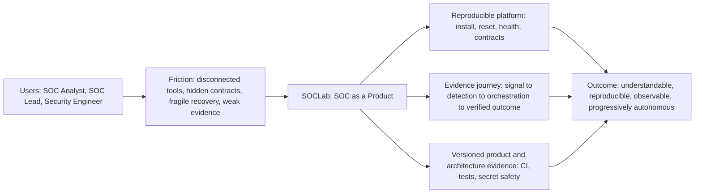
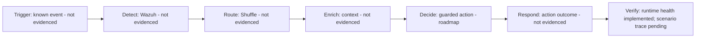
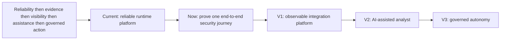

# SOCLab Product Story

SOCLab treats a security-operations lab as a **product**, not as a pile of installed tools. The product goal is to make a complex SOC workflow understandable, reproducible, observable, and progressively autonomous while keeping high-impact automation controlled and evidence-based.

## Why it exists

The difficult problem is not installing Wazuh or Shuffle. It is creating a coherent operating product across deployment, detection, orchestration, integration contracts, health, recovery, evidence, and change control.

## User journey and current truth

The target analyst journey is **known signal → detection → orchestration → context → guarded decision → response → proof**. The repository is intentionally explicit about what is already implemented and what still needs evidence.

**Implemented strongly today:** deterministic install/reset, Wazuh and Shuffle health validation, API/port/network contracts, secret-safety checks, regression tests, recovery paths, and architecture-change governance.

**Next evidence milestone:** commit one deterministic security scenario that proves the complete path from a known trigger through Wazuh detection into the expected Shuffle workflow and a final evidence artifact.

## Product evolution

The roadmap is intentionally ordered so autonomy is earned through reliability and evidence rather than added as a demo feature.

The product principle is: **reliability → evidenced user journey → visibility → assistance → governed action**.

## How the story stays credible

SOCLab keeps code, tests, architecture records, diagram sources, and product claims in version control. Architecture-sensitive changes are checked in CI, and the Mermaid rendering job produces reviewable SVG artifacts without touching the running lab. Capabilities should be described as implemented only when repository or runtime evidence can prove them.

For the implemented component topology, see [Architecture](architecture.md). For the diagram-as-code lifecycle, see [Architecture and product diagrams as code](diagrams/README.md).
