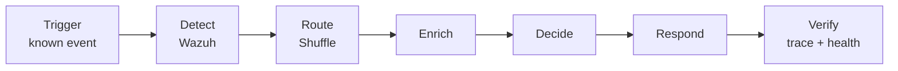

# User Journey

SOCLab's target analyst journey is the path from a known signal to provable evidence.

| Stage | User question | Required evidence | Current status |
|---|---|---|---|
| **Trigger** | Did the expected event occur? | Reproducible test event | **Not evidenced** |
| **Detect** | Did Wazuh recognize it? | Alert + rule context | **Not evidenced** |
| **Route** | Did the expected Shuffle workflow start? | Workflow invocation trace | **Not evidenced** |
| **Enrich** | Is enough context available? | Workflow output | **Not evidenced for SOC scenario** |
| **Decide** | What should happen next? | Decision record / guardrail | **Roadmap / scenario dependent** |
| **Respond** | Was the action executed? | Action outcome | **Not evidenced for SOC scenario** |
| **Verify** | Can the system prove health and outcome? | Trace/logs/health | **Implemented strongly for runtime health; scenario trace pending** |

## Product insight

The repository already validates a substantial **platform journey**: installation → component startup → API/network/datastore checks → health table → repair/rebuild. What is missing is the **security-event journey** above.

## Next evidence milestone

Add one deterministic scenario with:

1. a committed trigger command or fixture;
2. the expected Wazuh rule/alert;
3. the Wazuh→Shuffle integration contract;
4. the expected Shuffle workflow/run;
5. a final evidence artifact proving the outcome.
